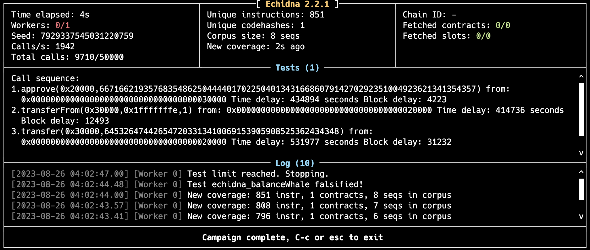

```solidity
function approve(address spender, uint256 value) public {
    allowance[msg.sender][spender] = value;
    emit Approval(msg.sender, spender, value);
}
```

As you can see, `0x3000` can `approve` whatever amount he wants to another one.
So, firstly, `0x3000` `approve(0x2000, val)`

```solidity
constructor(address _player) {
    player = _player;
    totalSupply = 1000;
    balanceOf[player] = 1000;
}
```

According to the constructor, the one who deployed contract will have 1000 tokens, so `0x3000` have 1000 token.

```solidity
function _transfer(address to, uint256 value) internal {
    unchecked {
        balanceOf[msg.sender] -= value;
        balanceOf[to] += value;
    }

    emit Transfer(msg.sender, to, value);
}

function transferFrom(address from, address to, uint256 value) public {
    require(balanceOf[from] >= value);
    require(balanceOf[to] + value >= balanceOf[to]);
    require(allowance[from][msg.sender] >= value);

    allowance[from][msg.sender] -= value;
    _transfer(to, value);
}
```

So, `0x2000` has allwance from `0x3000`, so he can call `transferFrom(0x3000, randomAddr, val)`.
The real problem in `transferFrom` is that the balance value is subtracted from `msg.sender`'s account rather than `from`'s account, so if 0x2000's balance is 0, then it will underflow
So, if `0x2000` calls `transferFrom(0x3000, 1, 0xffff)`, because `0x3000`'s balance is 1000, and this function will be executed, then `0x2000`'s balance will underflow to `type(uint256).max` (0 - 1 -> 2^256-1).
At last, `0x2000` transfer these tokens back to `0x3000`.

